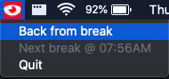

# Strainy


## Description

Strainy is a status bar app that sends a notification every 20 minutes to take a break from looking at the screen.

It is an application to help follow the 20-20-20 rule, every 20 minutes, look at something 20 feet away, for 20 seconds.

## Requirements

* python3

## Installation

```
python3 -m pip install -r requirements.txt
python3 main.py
```

## Usage

Every 20 minutes the icon will turn red, an audible notification will sound, and a visual notificaiton will appear telling you to take a break.


When you have taken the break, click the icon, then the button that says `Back from break`. This will reset the timer and the icon.




## Future Enhancements

[] Add menu to start timer for 20 second break

[] Package as a standalone Mac application

[] Change to custom icons

[] Start in dock hidden


## Resources

[Rumps Library](https://github.com/jaredks/rumps)

[Normal Eye Icon](http://www.freepik.com/)

[Red Eye Icon](https://www.flaticon.com/authors/surang)